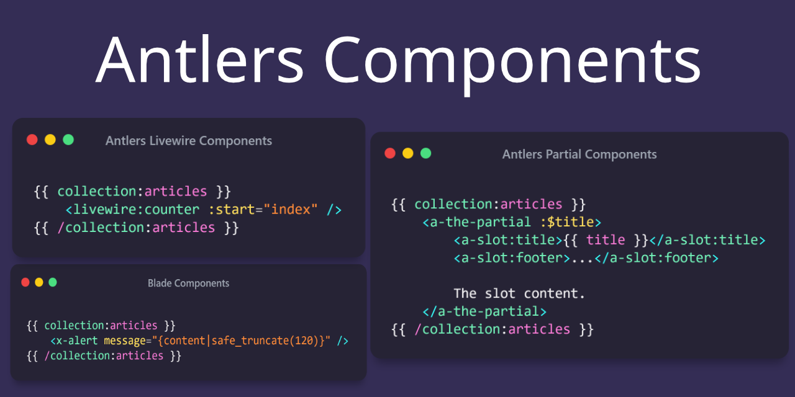

Antlers Components is a Statamic addon that makes creating isolated, reusable Antlers partials easy and integrating existing Blade and Livewire components a breeze using a familiar syntax.

## Installation

You may install Antlers Components using composer:

```bash
composer require stillat/antlers-components
```

## Requirements

Antlers Components requires at least PHP 8.1 and:

* Statamic version `3.4.*` or higher
* Laravel `9.36` or higher

This package provides a familiar syntax for Livewire components, and it is compiled into the Antlers tags provided by this package:

[https://statamic.com/addons/jonassiewertsen/livewire](https://statamic.com/addons/jonassiewertsen/livewire)

In order to use the Livewire syntax, you will also need to install it using the following command:

```bash
composer require jonassiewertsen/statamic-livewire
```

For support/reporting issues related to the Livewire functionality beyond compilation errors, please use the following GitHub link:

[https://github.com/jonassiewertsen/statamic-livewire](https://github.com/jonassiewertsen/statamic-livewire)

## Using Blade Components

You may use Blade Components within your Antlers template using the syntax you are familiar with.

For example, to include a `card` Blade component we may use the `<x-card />` syntax. This package supports Blade component slots; you may use Antlers within the slot:

```antlers
{{ collection:articles }}
    <x-card class="shadow-sm">
        <x-slot:heading class="font-bold">
            {{ title }}
        </x-slot>
    
        {{ content | safe_truncate(120) }}
    
        <x-slot:footer class="text-sm">
            ...
        </x-slot>
    </x-card>
{{ /collection:articles }}

```

Using Antlers inside parameter values is acceptable.

## Livewire Components

We can integrate existing Livewire components in our Antlers templates using the `<livewire />` syntax like so:

```antlers
{{ collection:articles }}
    <livewire:counter :start="index" />
{{ /collection:articles }}
```

Using Antlers inside parameter values is acceptable.

## Supported Parameter Types

This package supports the following parameter types when compiling component tags to Antlers:

**Shorthand Variables**:

```antlers
{{ title = 'The title'; }}

<x-alert :$title />
```

**Variable References**:

```antlers
{{ title = 'The title'; }}

<x-alert :title="title" />
```

**Name/Value**:

```antlers

{{ title = 'The title'; }}

<x-alert title="title" />
```

**Attribute**:

```antlers
<x-editor readonly />
```

## Antlers Components

This package also supports the concept of Antlers "components", which are really just syntax sugar on top of partials (with a few special behaviors).

As an example, we could include a partial named `partial-name.antlers.html` using this library like so:

```antlers
<a-partial-name :$title />
```

**Very Important**: When using this syntax, the partials **will not** inherit the scope they were included in (except for the general Cascade). This means that if we want current data to be supplied to our partial, we must explicitly pass it in via. parameters.

The behavior of slots is also slightly different when using this syntax, and is closer to anonymous Blade components.

Let us consider an Antlers partial named `_card.antlers.html`:

```antlers
<div {{ attributes.class(['border']) }}>
    <h1 {{ title.attributes.class(['border']) }}>
        {{ title }}
    </h1>
    
    {{ slot }}
    
    <footer {{ footer.attributes.class(['text-gray-700']) }}>
        {{ footer }}
    </footer>
</div>
```

we can render this Antlers partial in our main template like so:

```antlers
{{ collection:articles }}
    <a-card :$title :$content>
        <a:slot:title>{{ title }}</a:slot:title>
        <a:slot:footer>...</a:slot:footer>

        {{ content | safe_truncate(120) }}
    </a-card>
{{ /collection:articles }}
```

> Note: We have to explicitly allow the current article's title and content values by supplying them via. parameters. Without this, it will default to the current page's values.


When using this syntax, we do not need to prefix named slots with `slot:` inside our partial. Additionally, we also have access to an attributes bag. Parameters supplied to named slots will be available within the partial, as well:

```antlers
{{ collection:articles }}
    <a-card :$title :$content>
        <a:slot:title class="custom title classes">{{ title }}</a:slot:title>
        <a:slot:footer>...</a:slot:footer>

        {{ content | safe_truncate(120) }}
    </a-card>
{{ /collection:articles }}
```

### Nesting Antlers Component Partials

We may also nest partial components by including them within other components. Like with regular components, we must specify what values we want to be passed along to our nested components:

```antlers
<div>
    <a-child-partial :$title />
</div>
```

We can check if we are inside a nested/child component using the `__is_nested` variable:

```antlers
{{ if __is_nested }}
    I am a nested partial.
{{ else }}
    I am not nested.
{{ /if }}
```

We can also see how deeply nested we are using the `__depth` variable:

```antlers
The current nested partial depth is: {{ __depth }}.
```

And finally, we may access data from the parent partial if we are nested by referencing the `__parent` variable:

```antlers
{{ __parent.title }}
```

If that parent has a parent, we can keep on going:

```antlers
{{ __parent.__parent.title }}
```

## License

This addon is open-sourced software licensed under the [MIT license](https://opensource.org/licenses/MIT).